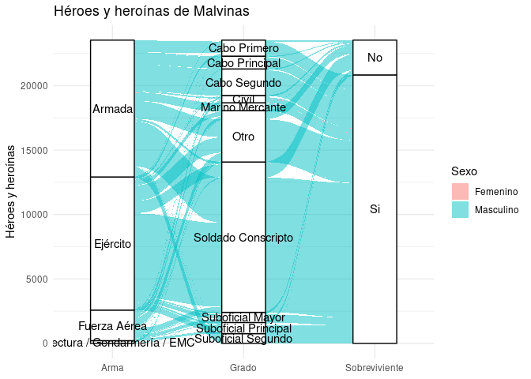

<!-- README.md is generated from README.Rmd. Please edit that file -->

# `{malvinas}`

<!-- badges: start -->
<!-- badges: end -->

Sets de datos de las Islas Malvinas, Georgias del Sur y Sándwich del
Sur. Datos obtenidos de <http://www.veteranos.mindef.gov.ar/>.

## Instalación

Por el momento, se debe instalar `{malvinas}` via GitHub, mediante los
comandos:

``` r
install.packages("remotes")
remotes::install_github("jcrodriguez1989/malvinas")
```

## Ejemplo

``` r
library("malvinas")
dplyr::glimpse(veteranos)
```

    ## Rows: 23,533
    ## Columns: 7
    ## $ Apellidos <chr> "ABACA", "ABAD", "ABAL", "ABALLAY", "ABALOS", "ABATI", "ABBO…
    ## $ Nombres   <chr> "Sabino Benito", "Raul Benito", "Guillermo Daniel", "Eduardo…
    ## $ Arma      <chr> "Ejército", "Ejército", "Ejército", "Ejército", "Ejército", …
    ## $ Grado     <chr> "Sargento Ayudante", "Sargento Ayudante", "Soldado Conscript…
    ## $ Categoria <chr> "Vivos", "Vivos", "Vivos", "Vivos", "Vivos", "Vivos", "Vivos…
    ## $ Sexo      <chr> "Masculino", "Masculino", "Masculino", "Masculino", "Masculi…
    ## $ Documento <int> 12421358, 14899442, 14686467, 11973483, 10993984, 16362222, …

Alluvial plot

``` r
suppressPackageStartupMessages(library("dplyr"))
library("ggalluvial", quietly = TRUE)
library("malvinas")

# Conteos por grupo.
veteranos_agrupados <- mutate(
  veteranos,
  Sobreviviente = if_else(Categoria == "Vivos", "Si", "No"),
  # Guardar el top-9 grados con más gente.
  Grado = if_else(
    Grado %in% head(count(veteranos, Grado, sort = TRUE), n = 9)$Grado, Grado, "Otro"
  )
) %>%
  count(Arma, Grado, Sexo, Sobreviviente, name = "Gente") %>%
  # Agrupar categorías muy pequeñas.
  mutate(Arma = gsub(
    "(Prefectura)|(Gendarmería)|(Estado Mayor Conjunto)", "Prefectura / Gendarmería / EMC", Arma
  ))

ggplot(veteranos_agrupados, aes(axis1 = Arma, axis2 = Grado, axis3 = Sobreviviente, y = Gente)) +
  scale_x_discrete(limits = c("Arma", "Grado", "Sobreviviente"), expand = c(.2, .05)) +
  geom_alluvium(aes(fill = Sexo)) +
  geom_stratum() +
  geom_text(stat = "stratum", aes(label = after_stat(stratum))) +
  theme_minimal() +
  ylab("Héroes y heroínas") +
  ggtitle("Héroes y heroínas de Malvinas")
```


